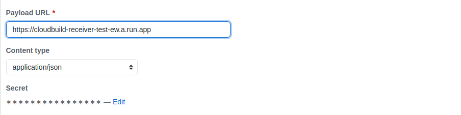

# cloudbuild-go-example
This project contains an example to run CloudBuild from Go

It consists in two components:
- cloudbuild-receiver
- cloudbuild-runner

**Notes:**
- You can run these components as Google Cloud Run
- For this example only push events are allowed from GitHub

## cloudbuild-receiver
This component is the entry point from the github webhook.

It doesn't run CloudBuild directly because GitHub has a short timeout to answer, so it answers as fast a it can and public the payload from GitHub in a topic of Google PubSub.

Environment variables:
- SERVER_PORT: Server port to listen to (optional, default 8080)
- GCP_SA_KEY: Google service account key (mandatory). This servicce account should have "Pub/Sub Publisher" permissions
- GCP_PROJECT_ID: Google Cloud Project Id (mandatory)
- PUBSUB_TOPIC_NAME: Pub/Sub topic name (mandatory)
- GITHUB_SECRET: GitHub secret (mandatory)

## cloudbuild-runner
This component runs when *cloudbuild-receiver* publishes the payload of GitHub in a Google PubSub topic. It must be a subscription of that topic of type push.

It executes the cloudbuild.yaml file from a GitHub repo. The *cloudbuild.yaml* must exist in the root of the repo.

Environment variables:
- SERVER_PORT: Server port to listen to (optional, default 8080)
- GCP_SA_KEY: Google service account key (mandatory). This servicce account should have "Cloud Build Editor"  and "Storage Object Admin" permissions
- GCP_PROJECT_ID: Google Cloud Project Id (mandatory)
- GCP_CLOUDBUILD_BUCKET: Google Cloud Bucket to store the zip repo (mandatory)

## GitHub webhook
Github repos webhooks must be configured to point to the URL of the *cloudbuild-receiver* and add a secret. This secret must be the same as *cloudbuild-receiver* GITHUB_SECRET environment variable

